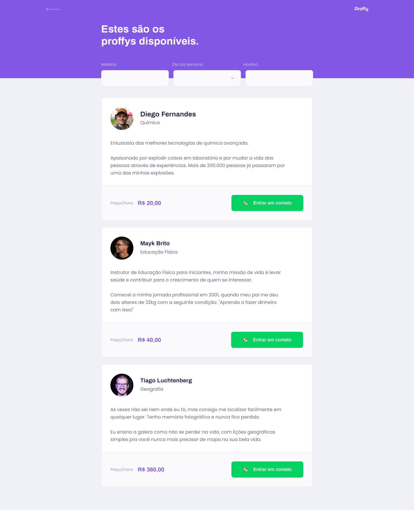

  
    

<h1 align="center">Projeto Proffy</h1>

## 📑 Índice

- [Sobre o Projeto](#-sobre-o-projeto)
- [Tecnologias utilizadas](#-tecnologias-utilizadas)
- [Design](#-design)
- [Executar esse projeto no seu computador](#Executar-esse-projeto-no-seu-computador)
- [Licença](#-licença)

## 💡 Sobre o Projeto

Criação do Proffy, uma plataforma para conexão professores e alunos.

## 🚀 Tecnologias utilizadas

O projeto foi desenvolvido utilizando as seguintes tecnologias:

- ReactJS
- React Native
- TypeScript
- HTML5 e CSS3
- NodeJS

## 🎨 Design

<table>
  <tr>
    <td colspan="2">Desktop</td>
    <td colspan="2">Mobile</td>
  </tr>
  <tr>
    <td></td><td></td>
    <td></td><td></td>
  </tr>
</table>

## 📥 Executar esse projeto no seu computador

- Clonar Repositório: `git clone git@github.com:Marxneves/NLW-02.git`

Ir para a pasta 'web' para rodar o front-end, ou ir para pasta 'server' para rodar o back-end:

- Instalar dependências: `yarn install`
- Rodar Aplicação: `yarn start`

## 📕 Licença

Todos os arquivos incluídos aqui, incluindo este _README_, estão sob [Licença MIT](./LICENSE). 
Criado por [MarxKhristie](https://github.com/marxneves)